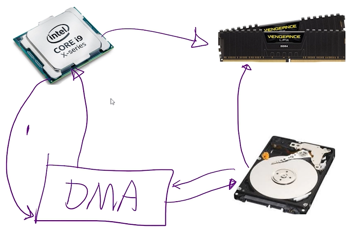
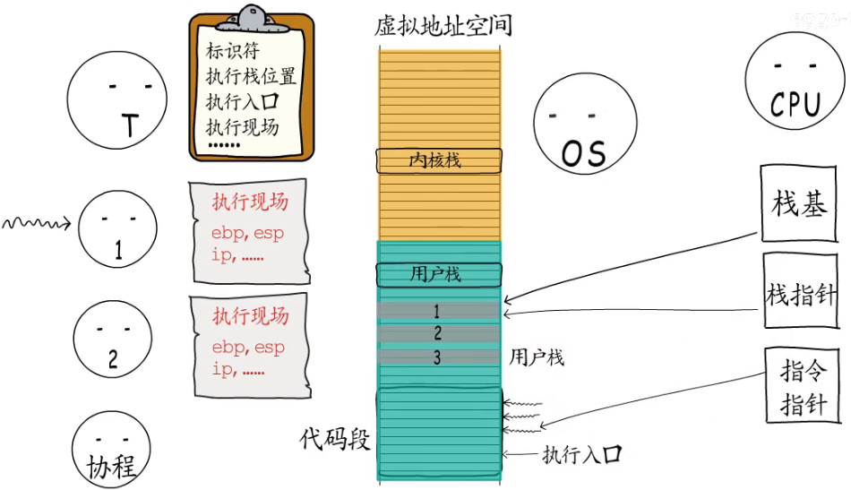

# 网络框架

## 五、30-35课    
  
  
### 阻塞IO、非阻塞IO、同步IO、异步IO    
> 阻塞、非阻塞是针对线程  

> 同步、异步 是针对请求    

> I/O -->磁盘、网络（网卡） IO      

> 多路复用：一个线程，利用epoll()，一次系统调用+内核层遍历多个文件描述符！！！(epoll内部是红黑树+链表结构)   
IO过程： 1.《某个线程中》CPU对DMA下达指令(磁盘信息和读取位置) ，DMA告知磁盘进行文件读取  
        2.磁盘直接把信息加载到内存，然后磁盘给DMA一个反馈()  
        3.DMA以中断的方式告诉CPU 完成磁盘操作  
        4.cpu《回到刚才的线程》去内存中读取需要的值  
CPU只需要处理1、4两个步骤，其余时间空闲


> 线程池里就是《请求线程》. 在异步下，谈阻塞或者非阻塞没有意义，因为异步下，线程端阻塞/非阻塞没有意义
```
阻塞IO：一个文件描述符(进程)《IO操作》处理完成后(成功或返回失败)，期间程序(进程)不做其他事
非阻塞IO：一个文件描述符(进程)《IO操作》在处理中，  

同步IO：同一个程序(进程/线程)进入IO操作后，等待IO完成，再进行程序的下一步  
    -- 做完一道题，才能做下一道
异步IO：... IO的时候可以进行程序的下一步，等IO完成后通知程序进行处理(不阻塞读写过程)    --看了题先拍照,看下一题，答案可以待会再写^-^--> 算出答案，服务端需要有一个消息会写的操作
好像不对！
```
#### 协程相关知识  

```

```

## 协程调度模块  
> 1.线程池，分配一组线程；2.协程调度器，将协程指定到相应的线程上去执行  
>
> Scheduler为管理协程模块，use_caller表示是否复用当前线程
>
> 如果复用需要将Scheduler::run()放入协程执行

```c++

                                            Scheduler —— —— template<>scheduler() 
                                                |
                                              start()
                                                |
                                               run()
                                                |
                                               stop()

用户通过模板函数template<>scheduler()将待执行任务或协程放入管理器中
管理器启动后，为每个线程绑定run函数
在run函数中，为管理器运行逻辑，依次从m_fibers中取出FiberAndThread的智能指针，判断任务为cb还是fiber，统一交由协程执行，执行完毕后回到run函数中，再次取出下一个FiberAndThread
stop函数中，依次通知不同线程

```

### 1)  Scheduler()

```c++
Scheduler::Scheduler(size_t threads, bool use_caller, const std::string& name)
    :m_name(name) {
    SYLAR_ASSERT(threads > 0);
    SYLAR_LOG_INFO(g_logger) << "Scheduler() ";
    // 复用该线程
    if(use_caller) {
        // 创建主协程
        sylar::Fiber::GetThis();
        --threads;
        SYLAR_ASSERT(GetThis() == nullptr);
        t_scheduler = this;
        // 协程运行run方法
        m_rootFiber.reset(new Fiber(std::bind(&Scheduler::run, this), 0, true));
        sylar::Thread::SetName(m_name);
        // 记录当前线程中的执行fiber
        t_fiber = m_rootFiber.get();
        m_rootThread = sylar::GetThreadId();
        // 当前线程加入线程池
        m_threadIds.push_back(m_rootThread);
    }
    else {
        m_rootThread = -1;
    }
    m_threadCount = threads;
}
```

### 2) start()

```c++
void Scheduler::start() {
    MutexType::Lock lock(m_mutex);
    if(!m_stopping) {
        return ;
    }
    m_stopping = false;
    SYLAR_ASSERT(m_threads.empty());
    // 申请给定大小的线程池
    m_threads.resize(m_threadCount);
    for(size_t i = 0;i<m_threadCount;++i) {
        // 每个线程绑定Scheduler::run函数
        m_threads[i].reset(new Thread(std::bind(&Scheduler::run, this)
                            , m_name + "_" + std::to_string(i)));
        // 记录线程id
        m_threadIds.push_back(m_threads[i]->getId());
    }
    lock.unlock();
}
```

### 3)  run()

```c++
void Scheduler::run() {
    set_hook_enable(true);
    setThis();
    if(sylar::GetThreadId() != m_rootThread) {
        t_fiber = Fiber::GetThis().get();
    }
    // 空闲协程 后续子类重写Scheduler::idle方法实现epoll_wait阻塞
    Fiber::ptr idle_fiber(new Fiber(std::bind(&Scheduler::idle, this)));
    Fiber::ptr cb_fiber;
    // 记录协程、线程、回调函数
    FiberAndThread ft;
    SYLAR_LOG_INFO(g_logger) << "run";
    while(true) {
        ft.reset();
        bool tickle_me = false;
        bool is_active = false;
        {
            MutexType::Lock lock(m_mutex);
            auto it = m_fibers.begin();
            while(it != m_fibers.end()) {
                // 当前线程不是指定执行线程，跳过
                if(it->thread != -1 && it->thread != sylar::GetThreadId()) {
                    ++it;
                    tickle_me = true;
                    continue;
                }
                SYLAR_ASSERT(it->fiber || it->cb);
                // 当前协程正在执行，跳过
                if(it->fiber && it->fiber->getState() == Fiber::EXEC) {
                    ++it;
                    continue;
                }
                // 取出当前任务，需要执行
                ft = *it;
                m_fibers.erase(it);
                ++m_activeThreadCount;
                is_active = true;
                break;
            }
        }

        if(tickle_me) {
            tickle();
        }
        // 取出的是协程任务，使用协程执行
        if(ft.fiber && (ft.fiber->getState() != Fiber::TERM
                        && ft.fiber->getState() != Fiber::EXCEPT)) {
            // 进入任务协程执行，本协程挂起
            ft.fiber->swapIn();
            --m_activeThreadCount;
            // 执行完后状态为READY，该协程继续放入管理器
            if(ft.fiber->getState() == Fiber::READY) {
                scheduler(ft.fiber);
            }
            // 执行完后状态不是TERM和EXCEPT，更改状态为HOLD，下次再次执行
            else if(ft.fiber->getState() != Fiber::TERM
                    && ft.fiber->getState() != Fiber::EXCEPT) {
                ft.fiber->m_state = Fiber::HOLD;
            }
            ft.reset();
        }
        // 取出的是回调函数，放入协程执行
        else if(ft.cb) {
            if(cb_fiber) {
                // 复用协程
                cb_fiber->reset(ft.cb);
            }
            else {
                cb_fiber.reset(new Fiber(ft.cb));
            }
            ft.reset();
            // 挂起当前协程，进入任务协程
            cb_fiber->swapIn();
            --m_activeThreadCount;
            // 重置任务 状态为READY，该协程继续放入管理器
            if(cb_fiber->getState() == Fiber::READY) {
                scheduler(cb_fiber);
                // 复用协程，重置
                cb_fiber.reset();
            }
            // 执行完毕或出错，协程置空
            else if(cb_fiber->getState() == Fiber::EXCEPT
                    || cb_fiber->getState() == Fiber::TERM) {
                cb_fiber->reset(nullptr);
            }
            // 其他状态时，协程挂起，重置协程，等待下次使用
            else{
                cb_fiber->m_state = Fiber::HOLD;
                cb_fiber.reset();
            }
        }
        // 协程任务，状态为执行超时或出错
        else {
            if(is_active) {
                --m_activeThreadCount;
                continue;
            }
            if(idle_fiber->getState() == Fiber::TERM) {
                SYLAR_LOG_INFO(g_logger) << "idle fiber term";
                break;
            }
            ++m_idleThreadCount;
            // 进入空闲协程 阻塞
            idle_fiber->swapIn();
            --m_idleThreadCount;
            if(idle_fiber->getState() != Fiber::TERM
                    && idle_fiber->getState() != Fiber::EXCEPT) {
                // 挂起
                idle_fiber->m_state = Fiber::HOLD;
            }
        }
    }
}
```

### 4) stop()

```c++
void Scheduler::stop() {
    m_autoStop = true;
    if(m_rootFiber 
            && m_threadCount == 0
            && (m_rootFiber->getState() == Fiber:: TERM
                || m_rootFiber->getState() == Fiber::INIT)) {
        SYLAR_LOG_INFO(g_logger) << this << "stopped";
        m_stopping = true;

        if(stopping()) {
            return ;
        }
    }
    if(m_rootThread != -1) {
        SYLAR_ASSERT(GetThis() == this);
    }
    else {
        SYLAR_ASSERT(GetThis() != this);
    }
    m_stopping = true;
    for(size_t i=0;i<m_threadCount;++i) {
        tickle();
    }

    if(m_rootFiber) {
        tickle();
    }

    if(m_rootFiber) {
        if(!stopping()) {
            // 执行主协程
            m_rootFiber->call();
        }
    }
    std::vector<Thread::ptr> thrs;
    {
        MutexType::Lock lock(m_mutex);
        thrs.swap(m_threads);
    }
    // 依次唤醒线程，等待执行完毕
    for(auto& x:thrs) {
        x->join();
    }
}
```

### 5)  template<>scheduler()

```c++
// 单个任务存入管理器，thread=-1不指定运行线程
template<class FiberOrCb>
void scheduler(FiberOrCb fc, int thread = -1) {
    bool need_tickle = false;
    {
        MutexType::Lock lock(m_mutex);
        need_tickle = schedulerNoLock(fc, thread);
    }
    if(need_tickle) {
        // 子类重写，实现唤醒epoll_wait
        tickle();
    }
}
// 实现迭代器存入管理器
template<class InputIterator>
void scheduler(InputIterator begin, InputIterator end, int thread = -1) {
    bool need_tickle = false;
    {
        MutexType::Lock lock(m_mutex);
        while(begin != end) {
            need_tickle = schedulerNoLock((&*begin), thread) || need_tickle;
            ++begin;
        }
    }
    if(need_tickle) {
        tickle();
    }
}
template<class FiberOrCb>
bool schedulerNoLock(FiberOrCb fc, int thread) {
    bool need_tickle = m_fibers.empty();
    // 创建FiberAndThread
    FiberAndThread ft(fc, thread);
    if(ft.fiber || ft.cb) {
        m_fibers.push_back(ft);
    }
    return need_tickle;
}
```

```cpp
/*
使用
Scheduler sc(3, false, "test");
sc.start();
sc.scheduler(&test_fiber);
sc.stop();
*/
```